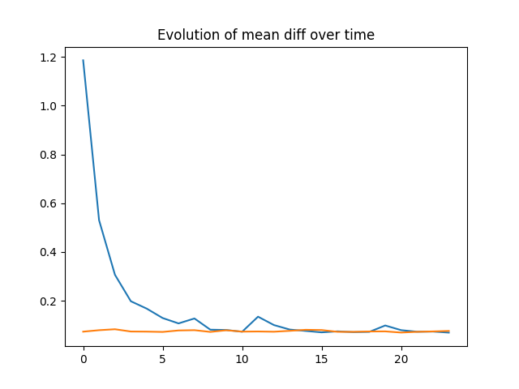

# DEMO: Earthquake Prediction

#### Disclaimer
This repository is a demo file.<br>
It's only purpose is to archive my tests.<br>
Please do not consider it as a project.<br>

However, feel free to send any pull request.

## Summary:

The main purpose of this demo is to work with RNN models in machin learning.<br>
So I decided to create a model to predict eathquakes.

Here is a [link](https://www.kaggle.com/c/LANL-Earthquake-Prediction/data) to the dataset I used.

## Workflow:

#### Preprocessing

The first task was to load the dataset, but it turns out that the dataset is much too heavy (more than 600M data).<br>
Therefore I only used 1M data splited between my test set and my train set.

After that I created my sequences, each sequence is of size 100 so my dataset was of shape (1M, 100) but to be feated I needed to reshape it into (1M, 100, 1, 1).

Here is the source code of the prepocessing part:

Loading dataset:
```py
def load_dataset(path):
    dataset = []
    labels = []
    with open(path, "r") as f:
        for index, line in enumerate(f):
            dataset.append(int(line.split(",")[0]))
            labels.append(float(line.split(",")[1]))
            if index >= MAX_DATA_SIZE:
                break

    return dataset, labels
```
Creating sequences:
```py
def create_seq(dataset, labels, seq_size):
    dataset_result = []
    labels_result = []
    data_batch = []
    label_batch = []

    for index in range(len(dataset)):
        if len(data_batch) == SEQU_SIZE:
            dataset_result.append(data_batch)
            labels_result.append(label_batch[-1])
            data_batch = []
            label_batch = []
        else:
            data_batch.append([dataset[index]])
            label_batch.append(labels[index])

    dataset_result, labels_result = shuffle(dataset_result, labels_result)
    return torch.tensor(dataset_result, dtype=torch.int16).unsqueeze(2), torch.tensor(labels_result, dtype=torch.float32)
```

#### Model

I decided to not use the [rnn layer provided by pytorch](https://pytorch.org/docs/stable/generated/torch.nn.RNN.html) but to create my own one.<br>
Considering the simple input data, I thought this model would suffice (it will):
```py
class RNN(nn.Module):
    def __init__(self, intput_size, hidden_size, output_size):
        super().__init__()

        self.hidden_size = hidden_size
        self.i2h = nn.Linear(intput_size + hidden_size, hidden_size)
        self.i2o = nn.Linear(intput_size + hidden_size, output_size)
        self.relu = nn.ReLU()

    def forward(self, input_tensor, hidden_tensor):
        combined = torch.cat((input_tensor, hidden_tensor), dim=1)

        hidden = self.i2h(combined)
        output = self.i2o(combined)

        output = self.relu(output)
        return output, hidden

    def init_hidden(self):
        return torch.zeros(1, self.hidden_size)
```
You may recognize the model made in [this tutorial](https://www.youtube.com/watch?v=WEV61GmmPrk), I did follow it to familiarise myself with RNN.

#### Results

The first try was a total fail, my results were completely inaccurate and I got nan in `loss`.<br>
After a few checks, I found out it was because of my optimizer.<br>
I was using the stochastic gradient descent (SGD) optimizer, changing it to Adam optimizer fixed my issue.

To test my model I used the mean difference between my prediction and the expected result (`train_diff` and `test_diff`).

Here are my results:<br>

